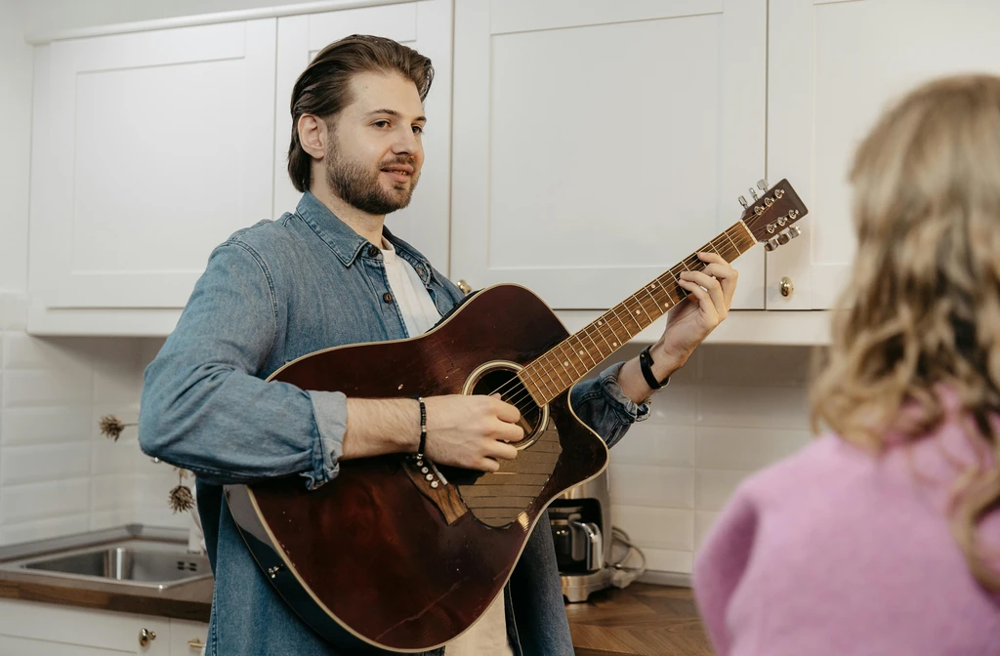
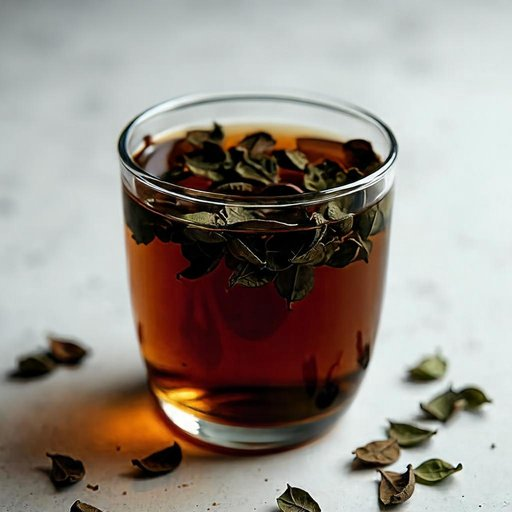
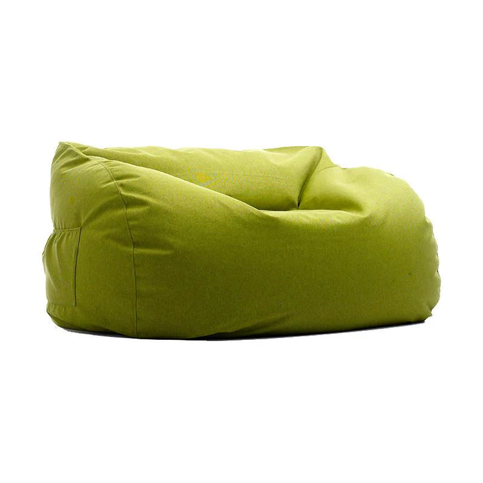
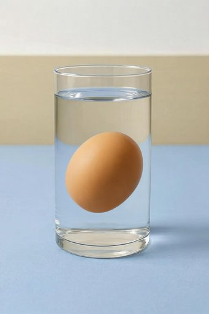
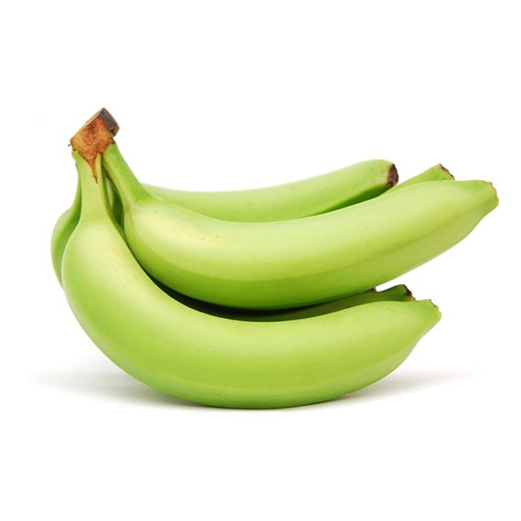
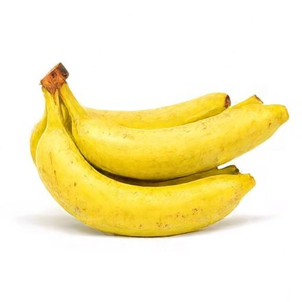
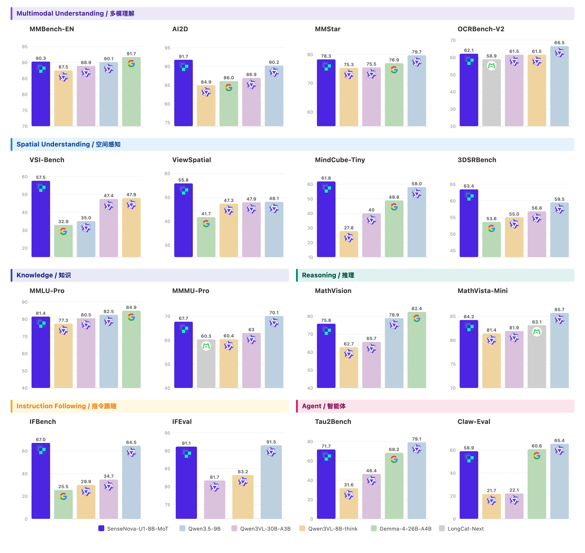
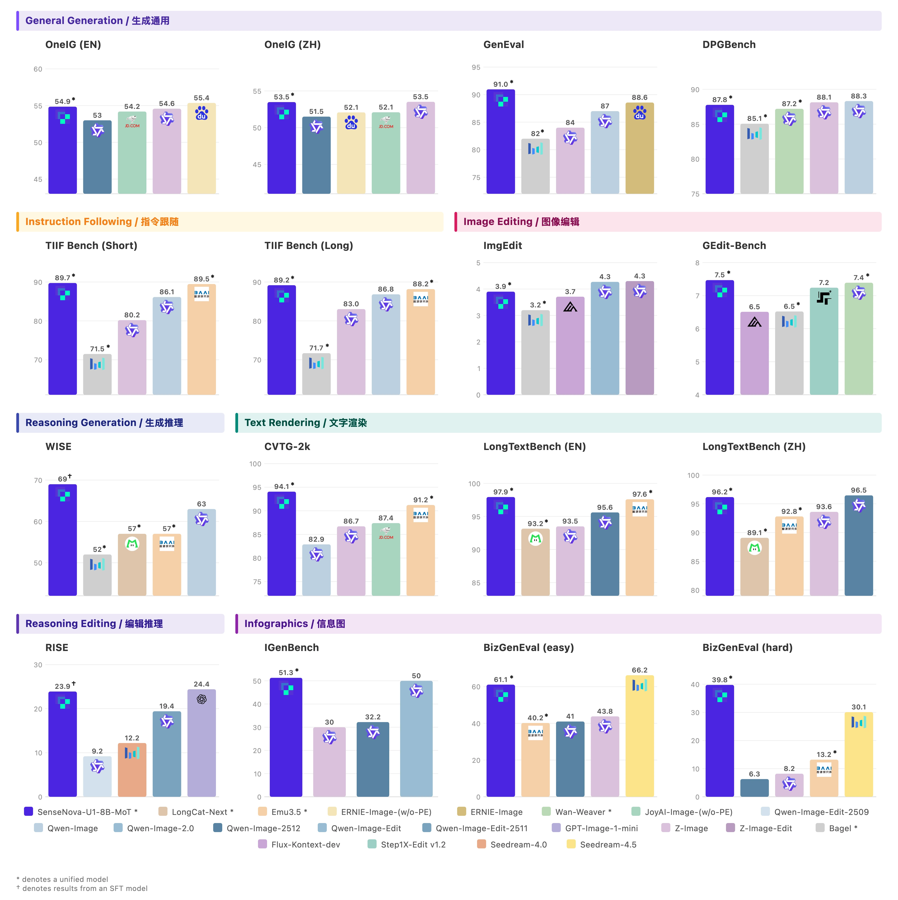
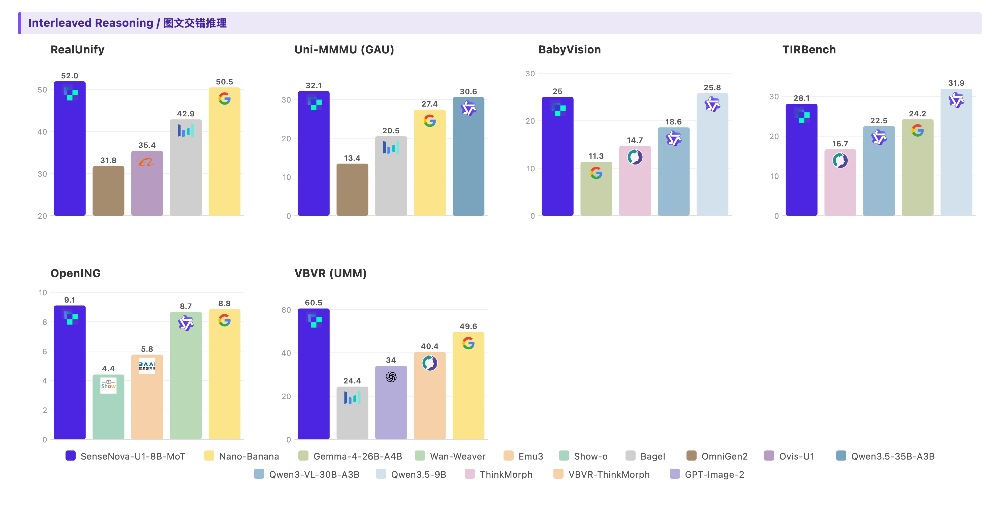

# SenseNova-U1: Unifying Multimodal Understanding and Generation with NEO-Unify Architecture

<p align="center">
  <strong>English</strong> | <a href="./README_CN.md">简体中文</a>
</p>

<p align="center">
  <a href="#"></a>
  <a href="https://huggingface.co/collections/sensenova/sensenova-u1"></a>
  <a href="https://unify.light-ai.top/"></a>
  <a href="./LICENSE"></a>
</p>

<p align="center">
  
</p>

## 🌟 Overview

🚀 **SenseNova-U1**, a native unified paradigm (based on **[NEO-Unify](https://huggingface.co/blog/sensenova/neo-unify)**) where models no longer translate between modalities, but think and act across them natively. 
Multimodal AI is no longer about connecting separate systems, but about building a unified one and trusting the necessary capabilities to emerge from within.


#### 🏗️ *Key Pillars :*      

- 🖼️ Near-Lossless Visual Interface: Preserving semantic richness + pixel fidelity (no VAEs or Vision Encoders) !  

- 🧠 Native Mixture-of-Transformers: Modality-agnostic reasoning with high efficiency and minimal conflict !   

- 🔗 Unified End-to-End Learning: Modeling directly on pixels + text from the first principles !   
  

#### 🌍 *Beyond Multimodality :* 

- 🤖 Vision–Language–Action (VLA)      

- 🌐 World Modeling (WM)


## 📣 Updated News

- `[2026.04.23]` Initial release of the weights for [SenseNova-U1-Mini-SFT](https://huggingface.co/sensenova/SenseNova-U1-Mini-Beta) and [SenseNova-U1-Mini-Beta](https://huggingface.co/sensenova/SenseNova-U1-Mini-Beta).  

- `[2026.04.23]` Initial release of the [inference code](https://github.com/OpenSenseNova/SenseNova-U1/blob/main/examples/README.md) for SenseNova-U1.   

## 📋 ToDo List

- [ ] Training code of SenseNova-U1 

- [ ] Final weights and technical report of SenseNova-U1


## 🦁 Model Zoo

| Model | Params | HF Weights |
| :---- | :------- | :--------- |
| SenseNova-U1-Mini-SFT | 8B MoT | [🤗 link](https://huggingface.co/sensenova/SenseNova-U1-Mini-SFT) |
| SenseNova-U1-Mini-Beta | 8B MoT | [🤗 link](https://huggingface.co/sensenova/SenseNova-U1-Mini-Beta) |
| SenseNova-U1-Flash-SFT | A3B MoT | 🤗 link |
| SenseNova-U1-Flash-Beta | A3B MoT | 🤗 link |

Note that the **SFT models** are trained in four stages: (1) *Understanding Warmup*, (2) *Generation Pre-training*, (3) *Unified Mid-training*, and (4) *Unified Supervised Fine-tuning*. The **Beta models** are obtained from the base model following an initial round of T2I reinforcement learning (RL) training.

## 🎨 Showcases

<details>
<summary>🖼️ Text-to-Image (General)</summary>

| | | |
| :---: | :---: | :---: |
| [](./docs/assets/showcases/t2i_general/16_9_dense_face_hd_07.webp) | [](./docs/assets/showcases/t2i_general/16_9_dense_text_rendering_18.webp) | [](./docs/assets/showcases/t2i_general/16_9_dense_text_rendering_12.webp) |
| [](./docs/assets/showcases/t2i_general/1_1_face_hd_13.webp) | [](./docs/assets/showcases/t2i_general/1_1_face_hd_17.webp) | [](./docs/assets/showcases/t2i_general/1_1_dense_artistic_10.webp) |
| [](./docs/assets/showcases/t2i_general/1_1_landscape_06.webp) | [](./docs/assets/showcases/t2i_general/1_1_dense_landscape_12.webp) | [](./docs/assets/showcases/t2i_general/1_1_landscape_07.webp) |
| [](./docs/assets/showcases/t2i_general/9_16_dense_face_hd_10.webp) | [](./docs/assets/showcases/t2i_general/9_16_human_pose_11.webp) | [](./docs/assets/showcases/t2i_general/9_16_artistic_07.webp) |
| [](./docs/assets/showcases/t2i_general/9_16_sensenova_u1_31.webp) | [](./docs/assets/showcases/t2i_general/9_16_dense_landscape_05.webp) | [](./docs/assets/showcases/t2i_general/9_16_dense_artistic_11.webp) |

</details>

<details>
<summary>🖼️ Text-to-Image (Reasoning)</summary>

<table>
  <tr>
    <th style="width: 20%">Original Text</th>
    <th style="width: 50%">Reasoning Process</th>
    <th style="width: 30%">Resulting Image</th>
  </tr>
  <tr>
    <td style="vertical-align: top;">A male peacock trying to attract a female</td>
    <td><div style="max-height: 200px; overflow-y: auto;">1. <b>Instruction Understanding:</b> The core subject is a single male peacock. The action involves the male peacock trying to attract a female. 2. <b>Reasoning Process:</b> Male peacocks perform this ritual by fanning their tail feathers into a massive, colorful circular display. 3. <b>Establish the frame:</b> The frame captures the male peacock in a full-body shot to show the entire display. The angle is eye-level to emphasize the height of the tail feathers. 4. <b>Set the lighting and color:</b> Natural lighting illuminates the colorful circular display with soft shadows. The palette features vibrant blues and greens on the tail feathers. 5. <b>Lock the style:</b> The style is a realistic photograph with sharp focus on the male peacock. The finish is natural without artistic filters. 6. <b>Explicit Prompt:</b> A vibrant male peacock with his tail feathers fully fanned out in a wide, iridescent display of blues and greens, standing in a garden.</div></td>
    <td style="vertical-align: top;"></td>
  </tr>
  <tr>
    <td style="vertical-align: top;">A small piece of dry wood and a dense iron block are in a transparent water tank</td>
    <td><div style="max-height: 200px; overflow-y: auto;">1. <b>Instruction Understanding:</b> The core subjects are a small piece of dry wood and a dense iron block positioned within a transparent water tank. The wood is floating on the surface while the iron block is submerged at the bottom. 2. <b>Reasoning Process:</b> The wood is less dense than water so it will float, while the iron is denser and will sink to the bottom. 3. <b>Establish the frame:</b> The composition is a vertical medium shot centering the rectangular tank within the frame. The camera angle is eye-level to clearly display the water line and the submerged base. Focus is sharp across the entire depth of the tank to ensure both materials are distinct. 4. <b>Build the environment:</b> The scene is contained entirely within the clear glass walls of the water tank. The water fills the majority of the volume, providing a medium for the floating wood and sunken iron block. The background remains out of focus to keep attention on the tank's interior. 5. <b>Set the lighting and color:</b> Soft natural light illuminates the scene from the left, creating gentle reflections on the water surface. The color palette features the brown grain of the wood contrasting against the dark grey metallic finish of the iron. Shadows are soft and diffused through the liquid. 6. <b>Explicit Prompt:</b> A realistic photo of a transparent water tank showing a piece of wood floating on the surface and an iron block resting at the bottom.</div></td>
    <td style="vertical-align: top;"></td>
  </tr>
</table>

</details>   

<details>
<summary>🖼️ Text-to-Image (Infographics)</summary>

| | | |
| :---: | :---: | :---: |
| [](./docs/assets/showcases/t2i_infographic/0001_2720x1536.webp) | [](./docs/assets/showcases/t2i_infographic/0002_2720x1536.webp) | [](./docs/assets/showcases/t2i_infographic/0003_2720x1536.webp) |
| [](./docs/assets/showcases/t2i_infographic/0004_2048x2048.webp) | [](./docs/assets/showcases/t2i_infographic/0005_2048x2048.webp) | [](./docs/assets/showcases/t2i_infographic/0006_2048x2048.webp) |
| [](./docs/assets/showcases/t2i_infographic/0007_1536x2720.webp) | [](./docs/assets/showcases/t2i_infographic/0008_1536x2720.webp) | [](./docs/assets/showcases/t2i_infographic/0009_1536x2720.webp) |

</details>  

> 📸 **More generation samples:** see [Image Generation Gallery](./docs/showcases.md#text-to-image). 


<details>
<summary>✏️ Image Editing (General)</summary>

| | |
| :---: | :---: |
| <div align="center"><a href="./examples/editing/data/images/1.webp"></a> <a href="./examples/editing/data/images/1_out.webp"></a><br><sub>Change the jacket of the person on the left to bright yellow.</sub></div> | <div align="center"><a href="./examples/editing/data/images/3.webp"></a> <a href="./examples/editing/data/images/3_out.webp"></a><br><sub>在小狗头上放一个花环，并且把图片变为吉卜力风格。</sub></div> |
| <div align="center"><a href="./examples/editing/data/images/2.webp"></a> <a href="./examples/editing/data/images/2_out.webp"></a><br><sub>Make the person in the image smile.</sub></div> | <div align="center"><a href="./examples/editing/data/images/4.webp"></a> <a href="./examples/editing/data/images/4_out.webp"></a><br><sub>Add a bouquet of flowers.</sub></div> |
| <div align="center"><a href="./examples/editing/data/images/8.webp"></a> <a href="./examples/editing/data/images/8_out.webp"></a><br><sub>Replace the man with a woman.</sub></div> | <div align="center"><a href="./examples/editing/data/images/6.webp"></a> <a href="./examples/editing/data/images/6_out.webp"></a><br><sub>Replace the text "WARFIGHTER" to "BATTLEFIELD" in the bold orange-red font.</sub></div> | 

</details>


<details>
<summary>✏️ Image Editing (Reasoning)</summary>

<table>
  <tr>
    <th style="width: 20%">Original Text</th>
    <th style="width: 30%">Original Image</th>
    <th style="width: 20%">Reasoning Process</th>
    <th style="width: 30%">Resulting Image</th>
  </tr>
  <tr>
    <td style="vertical-align: top;">Draw what it will look like one hour later.</td>
    <td style="vertical-align: top;"></td>
    <td><div style="max-height: 200px; overflow-y: auto;">
    1. <b>Source Image Analysis:</b> The source image shows a glass cup of hot tea with steeping tea leaves, and the water appears relatively clear. 2. <b>Instruction Understanding:</b> The instruction asks for the appearance one hour later. 3. <b>Reasoning Process:</b> Over time, tannins and pigments leach out, making the tea noticeably darker and more uniformly colored, and the leaves may look more swollen and darker from soaking. 4. <b>Expected Visual Changes:</b> The expected visible result is a deeper amber-to-brown tea color and more fully saturated liquid. 5. <b>Elements to Preserve:</b> The glass cup, scattered leaves around it, background, and camera angle should remain unchanged. 6. <b>Explicit Edit Prompt:</b> Edit the tea liquid to a much darker, more saturated amber-brown color as if fully steeped, and make the tea leaves look slightly darker and more swollen, while keeping the glass cup, surrounding leaves, background, and framing unchanged.</div></td>
    <td style="vertical-align: top;"></td>
  </tr>
  <tr>
    <td style="vertical-align: top;">Draw what it will look like immediately after someone stands up from sitting on it for a long time.</td>
    <td style="vertical-align: top;"></td>
    <td><div style="max-height: 200px; overflow-y: auto;">
    1. <b>Source Image Analysis:</b> The source image shows a fluffy lime-green beanbag chair that looks evenly plump and undisturbed on a white background. 2. <b>Instruction Understanding:</b> The edit instruction asks for its appearance immediately after someone stood up from sitting there for a long time. 3. <b>Reasoning Process:</b> Prolonged weight compresses the fabric and internal fill, leaving a depressed seat area, wrinkles radiating outward, and a slowly recovering shape. 4. <b>Expected Visual Changes:</b> The visible result should be a noticeable dip and creasing where a person was seated. 5. <b>Elements to Preserve:</b> The background, beanbag color, lighting, and camera angle should remain unchanged while only the beanbag’s shape shows the compression. 6. <b>Explicit Edit Prompt:</b> Edit the beanbag chair to show a clear seated depression in the center with surrounding wrinkles and slightly compressed fabric, while keeping the white background, lighting, and camera angle unchanged.</div></td>
    <td style="vertical-align: top;"></td>
  </tr>
  <tr>
    <td style="vertical-align: top;">Change the water to high-concentration saltwater</td>
    <td style="vertical-align: top;"></td>
    <td><div style="max-height: 200px; overflow-y: auto;">
    1. <b>Source Image Analysis:</b> The source image shows an egg resting at the bottom of a glass of water. 2. <b>Instruction Understanding:</b> The instruction asks to change the medium to high-concentration saltwater. 3. <b>Reasoning Process:</b> Saltwater is denser than fresh water, which increases the buoyant force on the egg. 4. <b>Expected Visual Changes:</b> As density increases, the egg will overcome gravity and float higher or suspend in the middle of the liquid. 5. <b>Elements to Preserve:</b> The glass and the egg's appearance should remain consistent, focusing on the shift in the egg's vertical position. 6. <b>Explicit Edit Prompt:</b> Edit the position of the egg so it is floating in the middle of the liquid instead of resting on the bottom, while keeping the glass and the egg's appearance unchanged.</div></td>
    <td style="vertical-align: top;"></td>
  </tr>
  <tr>
    <td style="vertical-align: top;">What the fruit looks like when ripe in the picture</td>
    <td style="vertical-align: top;"></td>
    <td><div style="max-height: 200px; overflow-y: auto;">
    1. <b>Source Image Analysis:</b> The source image shows green, unripe bananas. 2. <b>Instruction Understanding:</b> The instruction asks for the appearance of the fruit when ripe. 3. <b>Reasoning Process:</b> Ripening involves a breakdown of chlorophyll and the production of sugars, which turns the skin from green to yellow and often causes small brown sugar spots to appear. 4. <b>Expected Visual Changes:</b> The color and texture of the peel should transition to a ripe state. 5. <b>Elements to Preserve:</b> The shape of the bananas and the white background should remain constant. 6. <b>Explicit Edit Prompt:</b> Edit the green bananas to be bright yellow with small brown spots, while keeping the original shape and white background unchanged.</div></td>
    <td style="vertical-align: top;"></td>
  </tr>
</table>

</details>   

> 📸 **More editing samples:** see [Image Editing Gallery](./docs/showcases.md#image-editing). 

<details>
<summary>♻️ Interleaved Generation</summary>

| |
| :---: |
| [](./docs/assets/showcases/interleave/case_02.webp) |
| [](./docs/assets/showcases/interleave/case_03.webp) |

</details>

> 📸 **More interleaved samples:** see [Interleaved Generation Gallery](./docs/showcases.md#interleaved-generation).

<details>
<summary>📝 Visual Understanding</summary>

| |
| :---: |
| [](./docs/assets/showcases/vqa/agentic_case.webp) |
| [](./docs/assets/showcases/vqa/general_case.webp) |

</details>

> 📸 **More understanding samples:** see [Visual Understanding Gallery](./docs/showcases.md#visual-understanding). 


## 📊 Key Benchmarks

<details>
<summary>📝 Visual Understanding</summary>

<p align="center">
  
</p>

</details>

<details>
<summary>🖼️ Visual Generation</summary>

<p align="center">
  
</p>


</details>

<details>
<summary>♻️ Interleaved Generation</summary>

<p align="center">
  
</p>

</details>

> Evaluation scripts and benchmark reproduction guides are added in [`evaluation`](./evaluation/README.md).


## 🛠️ Quick Start


### 🌐 Use with SenseNova-Studio

The fastest way to experience SenseNova-U1 is through **[SenseNova-Studio](https://unify.light-ai.top/)** — a 🆓 free online playground where you can try the model directly in your browser, no installation or GPU required.


### 🦞 Use with SenseNova-Skills (OpenClaw)

The easiest way to integrate SenseNova-U1 into your own agent or application is through our companion repository **[SenseNova-Skills (OpenClaw) 🦞](https://github.com/OpenSenseNova/SenseNova-Skills)**, which ships SenseNova-U1 as a ready-to-use skill with a unified tool-calling interface.

> Refer to the [SenseNova-Skills README](https://github.com/OpenSenseNova/SenseNova-Skills) for installation and usage details.


### 🤗 Run with transformers

> **Setup:** Follow the [Installation Guide](./docs/installation.md) to clone the repo and install dependencies with uv.

<details>
<summary>📝 Visual Understanding</summary>

```bash
python examples/vqa/inference.py --model_path SenseNova/SenseNova-U1-Mini-Beta --image examples/vqa/data/images/menu.jpg --question "My friend and I are dining together tonight. Looking at this menu, can you recommend a good combination of dishes for 2 people? We want a balanced meal — a mix of mains and maybe a starter or dessert. Budget-conscious but want to try the highlights." --output outputs/answer.txt --max_new_tokens 8192 --do_sample --temperature 0.6 --top_p 0.95 --top_k 20 --repetition_penalty 1.05 --profile
```

</details>

> See [`examples/README.md`](./examples/README.md#visual-understanding-vqa) for batched inference, generation parameters, and JSONL format.

<details>
<summary>🖼️ Text-to-Image</summary>

```bash
python examples/t2i/inference.py --model_path SenseNova/SenseNova-U1-Mini-Beta --prompt "一个咖啡店门口有一个黑板，上面写着日日新咖啡，2元一杯，旁边有个霓虹灯，写着商汤科技，旁边有个海报，海报上面是一只小浣熊，海报下方写着SenseNova newbee。" --width 2048 --height 2048 --cfg_scale 4.0 --cfg_norm none --timestep_shift 3.0 --num_steps 50 --output output.png --profile
```

</details>

> Default resolution is 2048×2048 (1:1). See [supported resolution buckets](./examples/README.md#supported-resolution-buckets) for other aspect ratios.


<details>
<summary>✏️ Image Editing</summary>

```bash
python examples/editing/inference.py --model_path SenseNova/SenseNova-U1-Mini-Beta --prompt "Change the animal's fur color to a darker shade." --image examples/editing/data/images/1.jpg --cfg_scale 4.0 --img_cfg_scale 1.0 --cfg_norm none --timestep_shift 3.0 --num_steps 50 --output output_edited.png --profile --compare
```

</details>

> 💡 Pre-resize inputs to ~2048×2048 resolution with orginal aspect ratio before inference for best quality (see [`examples/editing/resize_inputs.py`](./examples/editing/resize_inputs.py)).


<details>

<summary>♻️ Interleaved Generation</summary>

```bash
python examples/interleave/inference.py --model_path SenseNova/SenseNova-U1-Mini-Beta --prompt "I want to learn how to cook tomato and egg stir-fry. Please give me a beginner-friendly illustrated tutorial." --resolution "16:9" --output_dir outputs/interleave/ --stem demo --profile
```
</details>

> See [`examples/README.md`](./examples/README.md) for batched inference, JSONL format, prompt enhancement, resolution buckets, and full flag reference.


### ⚡ Run with LightLLM + LightX2V

To efficiently serve a unified model that jointly handles understanding and generation, we co-design a dedicated inference stack on top of **[LightLLM](https://github.com/ModelTC/lightllm)** and **[LightX2V](https://github.com/ModelTC/lightx2v)**, featuring:

- **Disaggregated serving & transfer design** — understanding and generation workloads are served on separate engines with a low-overhead KV / feature transfer channel.
- **Understanding-side optimizations** — tailored kernels, scheduling, and KV management for the VLM path.
- **Generation-side optimizations** — Kernel fusion, CFG parallelism, Ulysses parallelism, and improved memory management for KV cache.

We observe competitive end-to-end latency and throughput across understanding, generation, and interleaved workloads.

> 📖 **Full design, benchmarking protocol, and performance numbers:** see [`docs/inference_infrastructure.md`](./docs/inference_infrastructure.md).

LightLLM and LightX2V offer offer official docker image for deployment:
`lightx2v/lightllm_lightx2v:20260407`.

```bash
docker pull lightx2v/lightllm_lightx2v:20260407
docker run -it --gpus all -p 8000:8000 -v /dev/shm:/dev/shm -v your_local_path:/data/ lightx2v/lightllm_lightx2v:20260407 /bin/bash
```

### 1. Clone dependencies in container

```bash
git clone https://github.com/ModelTC/LightX2V.git
git clone https://github.com/ModelTC/LightLLM.git
cd LightLLM && git checkout neo_plus_clean
```

### 2. Start API service (2-GPU example)

In this setup, understanding runs with `tp=2`, and generation uses `cfg=2`
parallelism via the LightX2V config file:

```bash
PYTHONPATH=/workspace/LightX2V/ \
python -m lightllm.server.api_server \
  --model_dir $MODEL_DIR \
  --enable_multimodal_x2i \
  --x2v_gen_model_config /workspace/LightX2V/configs/neopp/neopp_dense_parallel_cfg.json \
  --graph_max_batch_size 128 \
  --host 0.0.0.0 \
  --port 8000 \
  --max_req_total_len 65536 \
  --mem_fraction 0.75 \
  --x2i_server_used_gpus 2 \
  --tp 2
```

### 3. OpenAI-Compatible API

```bash
python examples/test_api.py \
  --mode t2i \
  --prompt "A cozy coffee shop storefront with infographic style."
```

For full deployment details and more test examples, see
[`docs/deployment.md`](./docs/deployment.md).
<!-- ## 🖊️ Citation

```bibtex

``` -->

## ⚖️ License

This project is released under the [Apache 2.0 License](./LICENSE).
