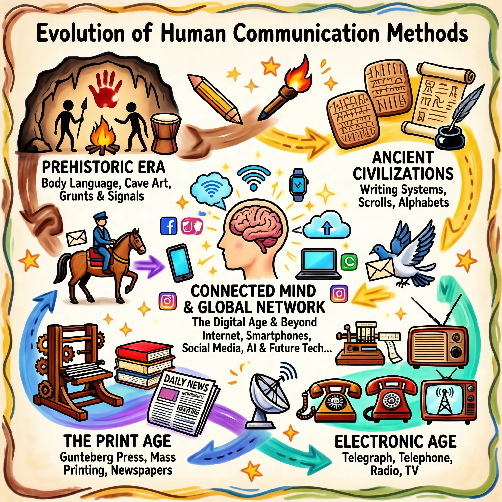
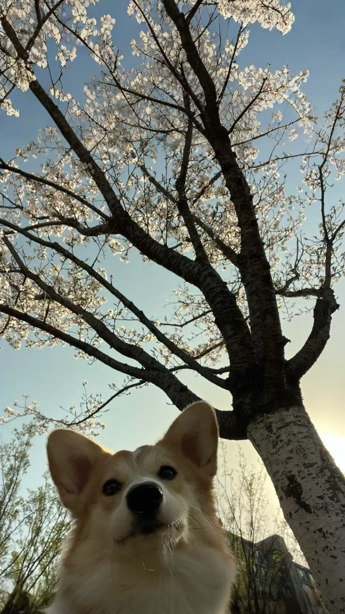
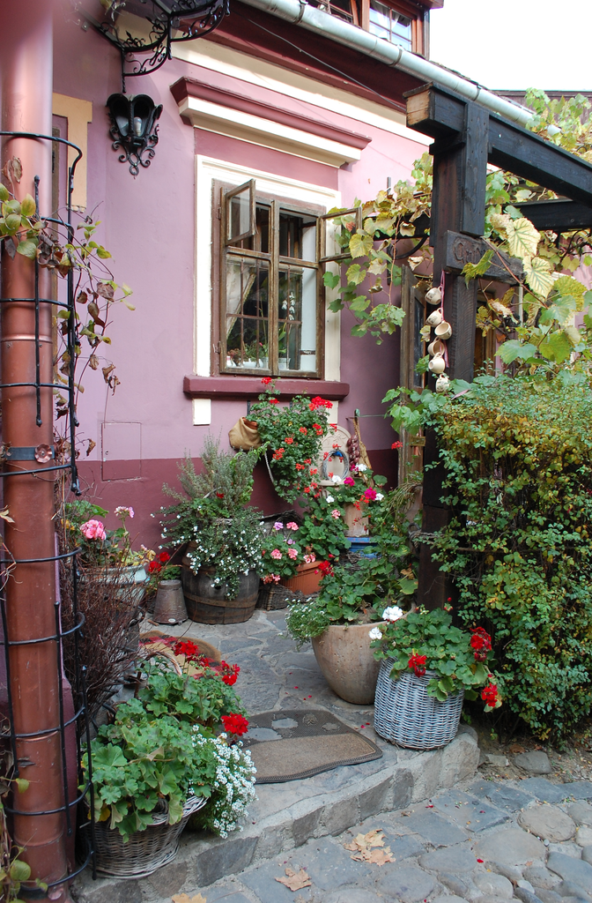
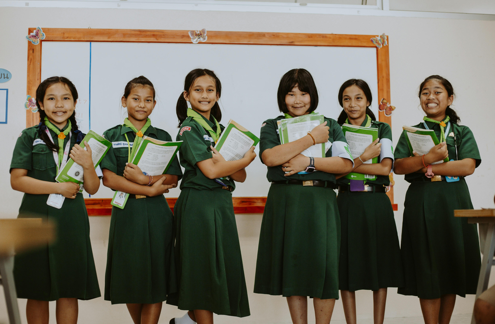
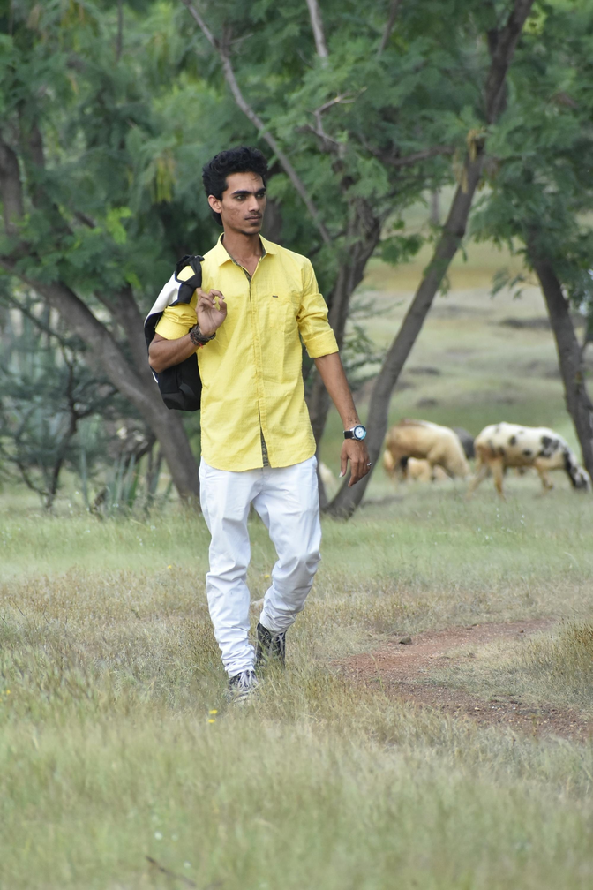
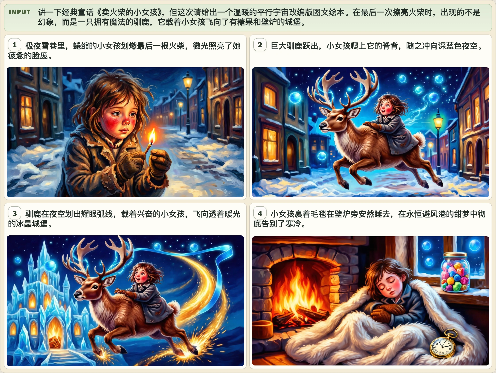
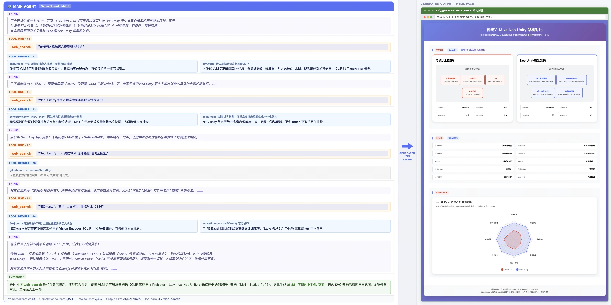
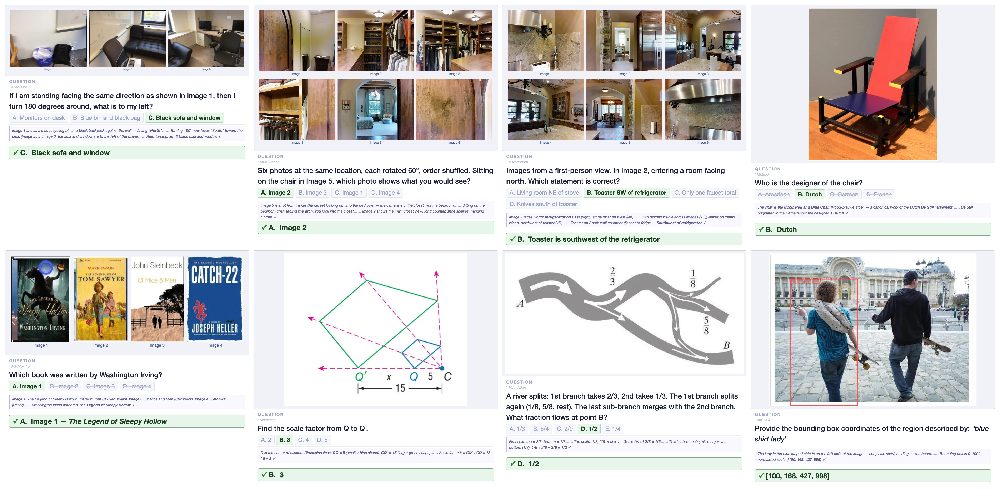

# SenseNova-U1: Unifying Multimodal Understanding and Generation with NEO-Unify Architecture

<p align="center">
  <strong>English</strong> | <a href="./README_CN.md">简体中文</a>
</p>

<p align="center">
  <a href="#"></a>
  <a href="#"></a>
  <a href="https://unify.light-ai.top/"></a>
  <a href="./LICENSE"></a>
</p>

<p align="center">
  
</p>

## Overview

Recent large vision–language models (VLMs) remain fundamentally constrained by a persistent dichotomy: understanding and generation are treated as distinct problems, leading to fragmented architectures, cascaded pipelines, and misaligned representation spaces. We argue that this divide is not merely an engineering artifact, but a structural limitation that hinders the emergence of native multimodal intelligence.
Hence, we introduce **SenseNova-U1**, a native unified multimodal paradigm built upon the **NEO-Unify** model, in which understanding and generation evolve as synergistic views of a single underlying process.
The key pillars are:
(i) A near-lossless visual interface that preserves both semantic richness and pixel fidelity without pre-trained vision encoders (VEs) and variational autoencoders (VAEs);
(ii) An end-to-end framework that operates directly on native inputs (i.e., pixels and text), showing impressive expressivity and generalization over modular counterparts;
(iii) A native Mixture-of-Transformers (MoT) architecture that supports modality-agnostic reasoning with minimal intrinsic conflict and high data-scaling efficiency.
We launch two native unified variants, **SenseNova-U1-Mini** and **SenseNova-U1-Flash**, built on dense (8B) and mixture-of-expert (30B-A3B) understanding baselines, respectively. Designed from first principles, they rival top-tier understanding-only VLMs across text understanding, vision–language perception, knowledge reasoning, agentic decision-making, and spatial intelligence. Meanwhile, they deliver strong semantic consistency and visual fidelity, excelling in conventional or knowledge-intensive any-to-image (X2I) synthesis, complex text-rich infographic generation, and interleaved vision–language generation, with or without think patterns. Beyond performance, we provide a comprehensive analysis of model design, data preprocessing, pre-/post-training, and inference strategies to support community research.
Last but not least, preliminary evidence displays that our models extend beyond perception and generation, performing strongly in vision–language–action (VLA) and world model (WM) scenarios. This points toward a broader roadmap where models do not translate between modalities, but think-and-act across them natively. Multimodal AI is no longer about connecting disparate systems. It is about building one that was never divided, and trusting the necessary capabilities to emerge from within.

## 📣 News

- `[TBD]` Initial release of SenseNova-U1 (code, weights, and technical report).

## 🦁 Model Zoo

<!-- TODO: fill in the table once weights are released -->

| Model | Params | HF Weights |
| :---- | :------- | :--------- |
| SenseNova-U1-Mini | 16B | [🤗 link (TBD)](#) |
| SenseNova-U1-Flash | 38BA3B | [🤗 link (TBD)](#) |

## 🎨 Showcases

A quick tour below; see [`docs/showcases.md`](./docs/showcases.md) for
additional editing and visual understanding samples.

### Text-to-Image (General)

| | | |
| :---: | :---: | :---: |
| [](./docs/assets/showcases/t2i_general/1_1_face_hd_13.webp) | [](./docs/assets/showcases/t2i_general/1_1_face_hd_17.webp) | [](./docs/assets/showcases/t2i_general/1_1_face_hd_07.webp) |
| [](./docs/assets/showcases/t2i_general/1_1_landscape_06.webp) | [](./docs/assets/showcases/t2i_general/1_1_dense_landscape_12.webp) | [](./docs/assets/showcases/t2i_general/1_1_landscape_07.webp) |
| [](./docs/assets/showcases/t2i_general/1_1_dense_artistic_09.webp) | [](./docs/assets/showcases/t2i_general/1_1_artistic_02.webp) | [](./docs/assets/showcases/t2i_general/1_1_dense_artistic_19.webp) |
| [](./docs/assets/showcases/t2i_general/9_16_artistic_02.webp) | [](./docs/assets/showcases/t2i_general/9_16_human_pose_11.webp) | [](./docs/assets/showcases/t2i_general/9_16_artistic_07.webp) |
| [](./docs/assets/showcases/t2i_general/9_16_text_rendering_02.webp) | [](./docs/assets/showcases/t2i_general/9_16_dense_landscape_05.webp) | [](./docs/assets/showcases/t2i_general/9_16_dense_artistic_11.webp) |
| [](./docs/assets/showcases/t2i_general/16_9_dense_face_hd_07.webp) | [](./docs/assets/showcases/t2i_general/16_9_dense_text_rendering_18.webp) | [](./docs/assets/showcases/t2i_general/16_9_dense_text_rendering_12.webp) |

### Text-to-Image (Infographics)

| | | |
| :---: | :---: | :---: |
| [](./docs/assets/showcases/t2i_infographic/0001_2720x1536.webp) | [](./docs/assets/showcases/t2i_infographic/0002_2720x1536.webp) | [](./docs/assets/showcases/t2i_infographic/0003_2720x1536.webp) |
| [](./docs/assets/showcases/t2i_infographic/0004_2048x2048.webp) | [](./docs/assets/showcases/t2i_infographic/0005_2048x2048.webp) | [](./docs/assets/showcases/t2i_infographic/0006_2048x2048.webp) |
| [](./docs/assets/showcases/t2i_infographic/0007_1536x2720.webp) | [](./docs/assets/showcases/t2i_infographic/0008_1536x2720.webp) | [](./docs/assets/showcases/t2i_infographic/0009_1536x2720.webp) |

### Image Editing

| | |
| :---: | :---: |
| <div align="center"><a href="./examples/editing/data/images/1.jpg"></a> <a href="./examples/editing/data/images/1_out.jpg"></a><br><sub>Change the jacket of the person on the left to bright yellow.</sub></div> | <div align="center"><a href="./examples/editing/data/images/2.jpg"></a> <a href="./examples/editing/data/images/2_out.jpg"></a><br><sub>Make the person in the image smile.</sub></div> |
| <div align="center"><a href="./examples/editing/data/images/3.jpg"></a> <a href="./examples/editing/data/images/3_out.jpg"></a><br><sub>在小狗头上放一个花环，并且把图片变为吉卜力风格。</sub></div> | <div align="center"><a href="./examples/editing/data/images/4.jpg"></a> <a href="./examples/editing/data/images/4_out.jpg"></a><br><sub>Add a bouquet of flowers.</sub></div> |
| <div align="center"><a href="./examples/editing/data/images/5.jpg"></a> <a href="./examples/editing/data/images/5_out.jpg"></a><br><sub>Turn the image into an American comic style.</sub></div> | <div align="center"><a href="./examples/editing/data/images/6.jpg"></a> <a href="./examples/editing/data/images/6_out.jpg"></a><br><sub>Replace the text "WARFIGHTER" to "BATTLEFIELD" in the bold orange-red font.</sub></div> |
| <div align="center"><a href="./examples/editing/data/images/7.jpg"></a> <a href="./examples/editing/data/images/7_out.jpg"></a><br><sub>Remove the person on the far right wearing a green skirt and a green top.</sub></div> | <div align="center"><a href="./examples/editing/data/images/8.jpg"></a> <a href="./examples/editing/data/images/8_out.jpg"></a><br><sub>Replace the man with a woman.</sub></div> |

> 📸 **More editing samples:** see [Image Editing gallery](./docs/showcases.md#image-editing).

### Interleaved Generation

| |
| :---: |
| [](./docs/assets/showcases/interleave/case_02.webp) |
| [](./docs/assets/showcases/interleave/case_03.webp) |

> 📸 **More interleaved samples:** see [Interleaved Generation gallery](./docs/showcases.md#interleaved-generation).

### Visual Understanding

| |
| :---: |
| [](./docs/assets/showcases/vqa/agentic_case.webp) |
| [](./docs/assets/showcases/vqa/general_case.webp) |

## 📊 Benchmarks

> TODO: Add Benchmark Chart

Evaluation scripts and benchmark reproduction guides will be added in `evaluation/`.


## 🛠️ Quick Start

### Use with SenseNova-Skills (zero-config, recommended)

The easiest way to try SenseNova-U1 is through our companion repository **[SenseNova-Skills](https://github.com/OpenSenseNova/SenseNova-Skills)**, which ships SenseNova-U1 as a ready-to-use skill.

Refer to the [SenseNova-Skills README](https://github.com/OpenSenseNova/SenseNova-Skills) for installation and usage details.


### Run with LightLLM + LightX2V

To efficiently serve a unified model that jointly handles understanding and generation, we co-design a dedicated inference stack on top of **[LightLLM](https://github.com/ModelTC/lightllm)** and **[LightX2V](https://github.com/ModelTC/lightx2v)**, featuring:

- **Disaggregated serving & transfer design** — understanding and generation workloads are served on separate engines with a low-overhead KV / feature transfer channel.
- **Understanding-side optimizations** — tailored kernels, scheduling, and KV management for the VLM path.
- **Generation-side optimizations** — Kernel fusion, CFG parallelism, Ulysses parallelism, and improved memory management for KV cache.

We observe competitive end-to-end latency and throughput across understanding, generation, and interleaved workloads.

> 📖 **Full design, benchmarking protocol, and performance numbers:** see [`docs/inference_infrastructure.md`](./docs/inference_infrastructure.md).


TBA: run with lightx2v


### Run with transformers

> **Setup:** Follow the [Installation Guide](./docs/installation.md) to clone the repo and install dependencies with uv.

#### Visual Understanding

```bash
python examples/vqa/inference.py --model_path OpenSenseNova/SenseNova-U1-Mini --image examples/vqa/data/images/menu.jpg --question "My friend and I are dining together tonight. Looking at this menu, can you recommend a good combination of dishes for 2 people? We want a balanced meal — a mix of mains and maybe a starter or dessert. Budget-conscious but want to try the highlights." --output outputs/answer.txt --max_new_tokens 8192 --do_sample --temperature 0.6 --top_p 0.95 --top_k 20 --repetition_penalty 1.05 --profile
```

> See [`examples/README.md`](./examples/README.md#visual-understanding-vqa) for batched inference, generation parameters, and JSONL format.

#### Visual Generation

##### Text-to-Image

```bash
python examples/t2i/inference.py --model_path OpenSenseNova/SenseNova-U1-Mini --prompt "一个咖啡店门口有一个黑板，上面写着日日新咖啡，2元一杯，旁边有个霓虹灯，写着商汤科技，旁边有个海报，海报上面是一只小浣熊，海报下方写着SenseNova newbee。" --width 2048 --height 2048 --cfg_scale 4.0 --cfg_norm none --timestep_shift 3.0 --num_steps 50 --output output.png --profile
```

> Default resolution is 2048×2048 (1:1). See [supported resolution buckets](./examples/README.md#supported-resolution-buckets) for other aspect ratios.

##### Image Editing

> 💡 Pre-resize inputs to ~2048×2048 before inference for best quality (see [`examples/editing/resize_inputs.py`](./examples/editing/resize_inputs.py)).

```bash
python examples/editing/inference.py --model_path OpenSenseNova/SenseNova-U1-Mini --prompt "Change the animal's fur color to a darker shade." --image examples/editing/data/images/1.jpg --cfg_scale 4.0 --img_cfg_scale 1.0 --cfg_norm none --timestep_shift 3.0 --num_steps 50 --output output_edited.png --profile --compare
```

##### Interleaved Generation

```bash
python examples/interleave/inference.py --model_path OpenSenseNova/SenseNova-U1-Mini --prompt "I want to learn how to cook tomato and egg stir-fry. Please give me a beginner-friendly illustrated tutorial." --resolution "16:9" --output_dir outputs/interleave/ --stem demo --profile
```

> See [`examples/README.md`](./examples/README.md) for batched inference, JSONL format, prompt enhancement, resolution buckets, and full flag reference.


## 🛠️ Development

To catch lint / formatting issues locally before they fail CI, install the
pre-commit hook once after cloning:

```bash
uv pip install pre-commit   # or: pip install pre-commit
pre-commit install
pre-commit run --all-files  # optional: check the whole repo now
```


## 🖊️ Citation

<!-- TODO: fill in once the paper is released -->
```bibtex

```

## ⚖️ License

This project is released under the [Apache 2.0 License](./LICENSE).
