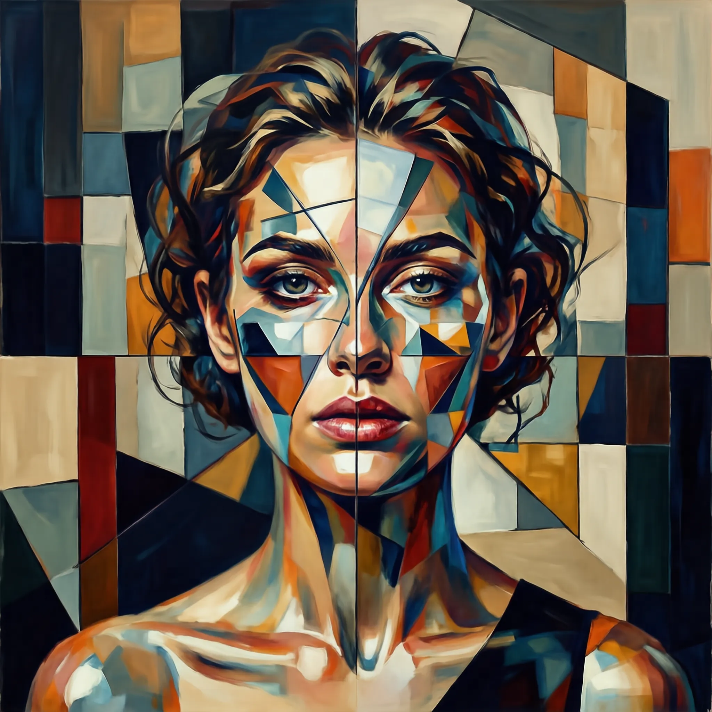

# SenseNova-U1: Unifying Multimodal Understanding and Generation with NEO-Unify Architecture

<p align="center">
  <strong>English</strong> | <a href="./README_CN.md">简体中文</a>
</p>

<p align="center">
  <a href="#"></a>
  <a href="https://huggingface.co/sensenova/SenseNova-U1-Mini-Beta"></a>
  <a href="https://unify.light-ai.top/"></a>
  <a href="./LICENSE"></a>
</p>

<p align="center">
  
</p>

## 🌟 Overview

🚀 **SenseNova-U1**, a native unified paradigm (based on **[NEO-Unify](https://huggingface.co/blog/sensenova/neo-unify)**) where models no longer translate between modalities, but think and act across them natively. 
Multimodal AI is no longer about connecting separate systems, but about building a unified one and trusting the necessary capabilities to emerge from within.


#### 🏗️ *Key Pillars :*      

- 🖼️ Near-Lossless Visual Interface: Preserving semantic richness + pixel fidelity (no VAEs or Vision Encoders) !  

- 🧠 Native Mixture-of-Transformers: Modality-agnostic reasoning with high efficiency and minimal conflict !   

- 🔗 Unified End-to-End Learning: Modeling directly on pixels + text from the first principles !   
  

#### 🌍 *Beyond Multimodality :* 

- 🤖 Vision–Language–Action (VLA)      

- 🌐 World Modeling (WM)


## 📣 Updated News

- `[2026.04.23]` Initial release of the weights for [SenseNova-U1-Mini-SFT](https://huggingface.co/sensenova/SenseNova-U1-Mini-Beta) and [SenseNova-U1-Mini-Beta](https://huggingface.co/sensenova/SenseNova-U1-Mini-Beta).  

- `[2026.04.23]` Initial release of the [inference code](https://github.com/OpenSenseNova/SenseNova-U1/blob/main/examples/README.md) for SenseNova-U1.   

## 📋 ToDo List

- [ ] Training code of SenseNova-U1 

- [ ] Final weights and technical report of SenseNova-U1


## 🦁 Model Zoo

| Model | Params | HF Weights |
| :---- | :------- | :--------- |
| SenseNova-U1-Mini-SFT | 8B MoT | [🤗 link](https://huggingface.co/sensenova/SenseNova-U1-Mini-SFT) |
| SenseNova-U1-Mini-Beta | 8B MoT | [🤗 link](https://huggingface.co/sensenova/SenseNova-U1-Mini-Beta) |
| SenseNova-U1-Flash-SFT | A3B MoT | 🤗 link |
| SenseNova-U1-Flash-Beta | A3B MoT | 🤗 link |

## 🎨 Showcases

#### 🖼️ *Text-to-Image (General Case)*

| | | |
| :---: | :---: | :---: |
| [](./docs/assets/showcases/t2i_general/16_9_dense_face_hd_07.webp) | [](./docs/assets/showcases/t2i_general/16_9_dense_text_rendering_18.webp) | [](./docs/assets/showcases/t2i_general/16_9_dense_text_rendering_12.webp) |
| [](./docs/assets/showcases/t2i_general/1_1_face_hd_13.webp) | [](./docs/assets/showcases/t2i_general/1_1_face_hd_17.webp) | [](./docs/assets/showcases/t2i_general/1_1_dense_artistic_10.webp) |
| [](./docs/assets/showcases/t2i_general/1_1_landscape_06.webp) | [](./docs/assets/showcases/t2i_general/1_1_dense_landscape_12.webp) | [](./docs/assets/showcases/t2i_general/1_1_landscape_07.webp) |
| [](./docs/assets/showcases/t2i_general/9_16_dense_face_hd_10.webp) | [](./docs/assets/showcases/t2i_general/9_16_human_pose_11.webp) | [](./docs/assets/showcases/t2i_general/9_16_artistic_07.webp) |
| [](./docs/assets/showcases/t2i_general/9_16_sensenova_u1_31.webp) | [](./docs/assets/showcases/t2i_general/9_16_dense_landscape_05.webp) | [](./docs/assets/showcases/t2i_general/9_16_dense_artistic_11.webp) |

#### 🖼️ *Text-to-Image (Infographics)*

| | | |
| :---: | :---: | :---: |
| [](./docs/assets/showcases/t2i_infographic/0001_2720x1536.webp) | [](./docs/assets/showcases/t2i_infographic/0002_2720x1536.webp) | [](./docs/assets/showcases/t2i_infographic/0003_2720x1536.webp) |
| [](./docs/assets/showcases/t2i_infographic/0004_2048x2048.webp) | [](./docs/assets/showcases/t2i_infographic/0005_2048x2048.webp) | [](./docs/assets/showcases/t2i_infographic/0006_2048x2048.webp) |
| [](./docs/assets/showcases/t2i_infographic/0007_1536x2720.webp) | [](./docs/assets/showcases/t2i_infographic/0008_1536x2720.webp) | [](./docs/assets/showcases/t2i_infographic/0009_1536x2720.webp) |

> 📸 **More text-to-image samples:** see [Text-to-Image gallery](./docs/showcases.md#text-to-image).


#### ✏️ *Image Editing*

| | | |
| :---: | :---: | :---: |
| [](./docs/assets/showcases/editing/0001_2048x2048_compare.webp) | [](./docs/assets/showcases/editing/0002_2048x2048_compare.webp) | [](./docs/assets/showcases/editing/0003_2048x2048_compare.webp) |

> 📸 **More editing samples:** see [Image Editing gallery](./docs/showcases.md#image-editing).

#### ♻️ *Interleaved Generation*

| |
| :---: |
| [](./docs/assets/showcases/interleave/case_02.webp) |
| [](./docs/assets/showcases/interleave/case_03.webp) |

> 📸 **More interleaved samples:** see [Interleaved Generation gallery](./docs/showcases.md#interleaved-generation).

#### 📝 *Visual Understanding*

| |
| :---: |
| [](./docs/assets/showcases/vqa/agentic_case.webp) |
| [](./docs/assets/showcases/vqa/general_case.webp) |


## 📊 Key Benchmarks

> TODO: Add Benchmark Chart

Evaluation scripts and benchmark reproduction guides will be added in `evaluation/`.


## 🛠️ Quick Start


### 🌐 Use with SenseNova-Studio

The fastest way to experience SenseNova-U1 is through **[SenseNova-Studio](https://unify.light-ai.top/)** — a 🆓 free online playground where you can try the model directly in your browser, no installation or GPU required.


### 🦞 Use with SenseNova-Skills (OpenClaw)

The easiest way to integrate SenseNova-U1 into your own agent or application is through our companion repository **[SenseNova-Skills (OpenClaw) 🦞](https://github.com/OpenSenseNova/SenseNova-Skills)**, which ships SenseNova-U1 as a ready-to-use skill with a unified tool-calling interface.

> Refer to the [SenseNova-Skills README](https://github.com/OpenSenseNova/SenseNova-Skills) for installation and usage details.


### 🤗 Run with transformers

> **Setup:** Follow the [Installation Guide](./docs/installation.md) to clone the repo and install dependencies with uv.

#### 📝 *Visual Understanding*

```bash
python examples/vqa/inference.py --model_path SenseNova/SenseNova-U1-Mini-Beta --image examples/vqa/data/images/menu.jpg --question "My friend and I are dining together tonight. Looking at this menu, can you recommend a good combination of dishes for 2 people? We want a balanced meal — a mix of mains and maybe a starter or dessert. Budget-conscious but want to try the highlights." --output outputs/answer.txt --max_new_tokens 8192 --do_sample --temperature 0.6 --top_p 0.95 --top_k 20 --repetition_penalty 1.05 --profile
```

> See [`examples/README.md`](./examples/README.md#visual-understanding-vqa) for batched inference, generation parameters, and JSONL format.

#### 🖼️ *Text-to-Image*

```bash
python examples/t2i/inference.py --model_path SenseNova/SenseNova-U1-Mini-Beta --prompt "一个咖啡店门口有一个黑板，上面写着日日新咖啡，2元一杯，旁边有个霓虹灯，写着商汤科技，旁边有个海报，海报上面是一只小浣熊，海报下方写着SenseNova newbee。" --width 2048 --height 2048 --cfg_scale 4.0 --cfg_norm none --timestep_shift 3.0 --num_steps 50 --output output.png --profile
```

> Default resolution is 2048×2048 (1:1). See [supported resolution buckets](./examples/README.md#supported-resolution-buckets) for other aspect ratios.

#### ✏️ *Image Editing*

> 💡 Pre-resize inputs to ~2048×2048 before inference for best quality (see [`examples/editing/resize_inputs.py`](./examples/editing/resize_inputs.py)).

```bash
python examples/editing/inference.py --model_path SenseNova/SenseNova-U1-Mini-Beta --prompt "Change the animal's fur color to a darker shade." --image examples/editing/data/images/1.jpg --cfg_scale 4.0 --img_cfg_scale 1.0 --cfg_norm none --timestep_shift 3.0 --num_steps 50 --output output_edited.png --profile --compare
```

#### ♻️ *Interleaved Generation*

```bash
python examples/interleave/inference.py --model_path SenseNova/SenseNova-U1-Mini-Beta --prompt "I want to learn how to cook tomato and egg stir-fry. Please give me a beginner-friendly illustrated tutorial." --resolution "16:9" --output_dir outputs/interleave/ --stem demo --profile
```

> See [`examples/README.md`](./examples/README.md) for batched inference, JSONL format, prompt enhancement, resolution buckets, and full flag reference.


### ⚡ Run with LightLLM + LightX2V

To efficiently serve a unified model that jointly handles understanding and generation, we co-design a dedicated inference stack on top of **[LightLLM](https://github.com/ModelTC/lightllm)** and **[LightX2V](https://github.com/ModelTC/lightx2v)**, featuring:

- **Disaggregated serving & transfer design** — understanding and generation workloads are served on separate engines with a low-overhead KV / feature transfer channel.
- **Understanding-side optimizations** — tailored kernels, scheduling, and KV management for the VLM path.
- **Generation-side optimizations** — Kernel fusion, CFG parallelism, Ulysses parallelism, and improved memory management for KV cache.

We observe competitive end-to-end latency and throughput across understanding, generation, and interleaved workloads.

> 📖 **Full design, benchmarking protocol, and performance numbers:** see [`docs/inference_infrastructure.md`](./docs/inference_infrastructure.md).


<!-- ## 🖊️ Citation

```bibtex

``` -->

## ⚖️ License

This project is released under the [Apache 2.0 License](./LICENSE).
