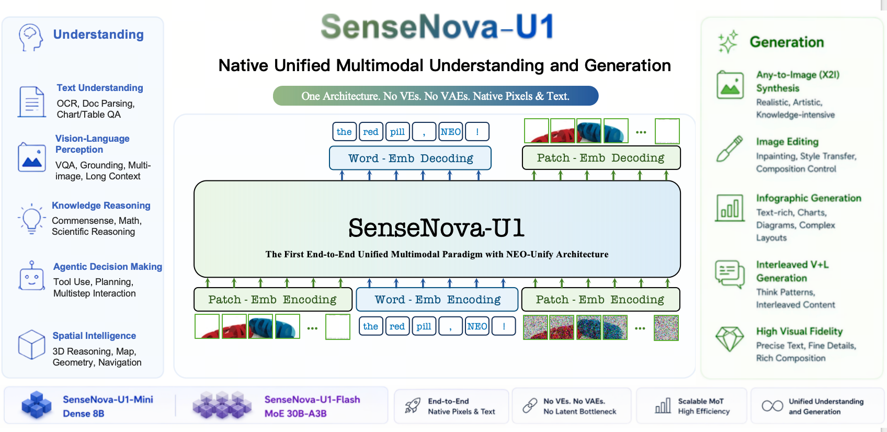

# SenseNova-U1: Unifying Multimodal Understanding and Generation with NEO-Unify Architecture

<p align="center">
  <strong>English</strong> | <a href="./README_CN.md">简体中文</a>
</p>

<p align="center">
  <a href="#"></a>
  <a href="#"></a>
  <a href="https://unify.light-ai.top/"></a>
  <a href="./LICENSE"></a>
</p>

<p align="center">
  
</p>

## Overview

Recent large vision–language models (VLMs) remain fundamentally constrained by a persistent dichotomy: understanding and generation are treated as distinct problems, leading to fragmented architectures, cascaded pipelines, and misaligned representation spaces. We argue that this divide is not merely an engineering artifact, but a structural limitation that hinders the emergence of native multimodal intelligence.
Hence, we introduce **SenseNova-U1**, a native unified multimodal paradigm built upon the **NEO-Unify** model, in which understanding and generation evolve as synergistic views of a single underlying process.
The key pillars are:
(i) A near-lossless visual interface that preserves both semantic richness and pixel fidelity without pre-trained vision encoders (VEs) and variational autoencoders (VAEs);
(ii) An end-to-end framework that operates directly on native inputs (i.e., pixels and text), showing impressive expressivity and generalization over modular counterparts;
(iii) A native Mixture-of-Transformers (MoT) architecture that supports modality-agnostic reasoning with minimal intrinsic conflict and high data-scaling efficiency.
We launch two native unified variants, **SenseNova-U1-Mini** and **SenseNova-U1-Flash**, built on dense (8B) and mixture-of-expert (30B-A3B) understanding baselines, respectively. Designed from first principles, they rival top-tier understanding-only VLMs across text understanding, vision–language perception, knowledge reasoning, agentic decision-making, and spatial intelligence. Meanwhile, they deliver strong semantic consistency and visual fidelity, excelling in conventional or knowledge-intensive any-to-image (X2I) synthesis, complex text-rich infographic generation, and interleaved vision–language generation, with or without think patterns. Beyond performance, we provide a comprehensive analysis of model design, data preprocessing, pre-/post-training, and inference strategies to support community research.
Last but not least, preliminary evidence displays that our models extend beyond perception and generation, performing strongly in vision–language–action (VLA) and world model (WM) scenarios. This points toward a broader roadmap where models do not translate between modalities, but think-and-act across them natively. Multimodal AI is no longer about connecting disparate systems. It is about building one that was never divided, and trusting the necessary capabilities to emerge from within.

## 📣 News

- `[TBD]` Initial release of SenseNova-U1 (code, weights, and technical report).

## 🦁 Model Zoo

<!-- TODO: fill in the table once weights are released -->

| Model | Params | HF Weights |
| :---- | :------- | :--------- |
| SenseNova-U1-Mini | 16B | [🤗 link (TBD)](#) |
| SenseNova-U1-Flash | 38BA3B | [🤗 link (TBD)](#) |

## 🎨 Showcases

### Infographics Generation

### Interleaved Generation


## 🛠️ Quick Start

### Use with SenseNova-Skills (zero-config, recommended)

The easiest way to try SenseNova-U1 is through our companion repository **[SenseNova-Skills](https://github.com/OpenSenseNova/SenseNova-Skills)**, which ships SenseNova-U1 as a ready-to-use skill.

Refer to the [SenseNova-Skills README](https://github.com/OpenSenseNova/SenseNova-Skills) for installation and usage details.


### Run with LightLLM + LightX2V

To efficiently serve a unified model that jointly handles understanding and generation, we co-design a dedicated inference stack on top of **[LightLLM](https://github.com/ModelTC/lightllm)** and **[LightX2V](https://github.com/ModelTC/lightx2v)**, featuring:

- **Disaggregated serving & transfer design** — understanding and generation workloads are served on separate engines with a low-overhead KV / feature transfer channel.
- **Understanding-side optimizations** — tailored kernels, scheduling, and KV management for the VLM path.
- **Generation-side optimizations** — step / sampler / cache optimizations for the X2I generation path.

We observe competitive end-to-end latency and throughput across understanding, generation, and interleaved workloads.

> 📖 **Full design, benchmarking protocol, and performance numbers:** see [`docs/inference_infrastructure.md`](./docs/inference_infrastructure.md).


TBA: run with lightx2v


### Run with transformers

We recommend [**uv**](https://docs.astral.sh/uv/) to manage the Python environment.

> uv installation guide: <https://docs.astral.sh/uv/getting-started/installation/>

### 1. Clone the repository

```bash
git clone https://github.com/OpenSenseNova/SenseNova-U1.git
cd SenseNova-U1
```

### 2. Install dependencies with uv

```bash
uv sync
source .venv/bin/activate
```

The `sensenova_u1` package is installed in
editable mode, so the canonical [NEO-Unify model](src/sensenova_u1/models/neo_unify/) is automatically registered with `transformers.Auto*` at import time.

> **Older NVIDIA drivers:** the default index is CUDA 12.8. If your driver
> does not support cu128, change `[tool.uv.sources]` / `[[tool.uv.index]]`
> in `pyproject.toml` to e.g. `https://download.pytorch.org/whl/cu126` (and
> adjust the pinned torch / torchvision versions accordingly) before
> running `uv sync`.

#### Optional: flash-attn

`flash-attn` is declared as an optional extra;
without it the model transparently falls back to torch SDPA;
once flash-attn is importable the runtime picks it automatically (`--attn_backend auto`).

```bash
# (a) Build from source via PyPI
uv sync --extra flash

# (b) Install a prebuilt CUDA wheel matching your torch + Python
uv pip install /path/to/flash_attn-2.8.3+cu12torch28cxx11abitrue-cp311-cp311-*.whl
```

#### Visual Understanding

```bash
TBA
```

#### Visual Generation

##### Text-to-Image

[`examples/t2i/inference.py`](./examples/t2i/inference.py) is a minimal text-to-image inference script for SenseNova-U1.

By default the model renders at **2048 × 2048** (1:1). You can override with `--width` / `--height`. SenseNova-U1 is trained on a set of resolution buckets (~2K total pixels) covering the following aspect ratios:

| Aspect ratio | Width × Height |
| :----------- | :------------- |
| 1:1          | 2048 × 2048    |
| 16:9 / 9:16  | 2720 × 1536 / 1536 × 2720 |
| 3:2 / 2:3    | 2496 × 1664 / 1664 × 2496 |
| 4:3 / 3:4    | 2368 × 1760 / 1760 × 2368 |
| 2:1 / 1:2    | 2880 × 1440 / 1440 × 2880 |
| 3:1 / 1:3    | 3456 × 1152 / 1152 × 3456 |

The script accepts arbitrary `--width` / `--height` and only emits a warning when they fall outside this table; quality may degrade for untrained shapes.

```bash
python examples/t2i/inference.py \
  --model_path OpenSenseNova/SenseNova-U1-Mini \
  --prompt "一个咖啡店门口有一个黑板，上面写着日日新咖啡，2元一杯，旁边有个霓虹灯，写着商汤科技，旁边有个海报，海报上面是一只小浣熊，海报下方写着SenseNova newbee。" \
  --width 2048 \
  --height 2048 \
  --cfg_scale 4.0 \
  --cfg_norm none \
  --timestep_shift 3.0 \
  --num_steps 50 \
  --output output.png \
  --profile
```

Run `python examples/t2i/inference.py --help` for the full flag list.

For batched inference, pass a JSONL file via `--jsonl` (see [`examples/t2i/data/samples.jsonl`](./examples/t2i/data/samples.jsonl)). Each line is `{"prompt": ...}` and optionally `{"width": W, "height": H, "seed": S}`:

```bash
python examples/t2i/inference.py \
    --model_path OpenSenseNova/SenseNova-U1-Mini \
    --jsonl examples/t2i/data/samples.jsonl \
    --output_dir outputs/ \
    --cfg_scale 4.0 \
    --cfg_norm none \
    --timestep_shift 3.0 \
    --num_steps 50 \
    --profile
```

##### Image Editing


TBA


#### Interleaved Generation

```bash
TBA
```


## 📊 Evaluation

<!-- TODO: link to evaluation guide once available -->
Evaluation scripts and benchmark reproduction guides will be released in `evaluation/`.


## 🖊️ Citation

<!-- TODO: fill in once the paper is released -->
```bibtex

```

## ⚖️ License

This project is released under the [Apache 2.0 License](./LICENSE).