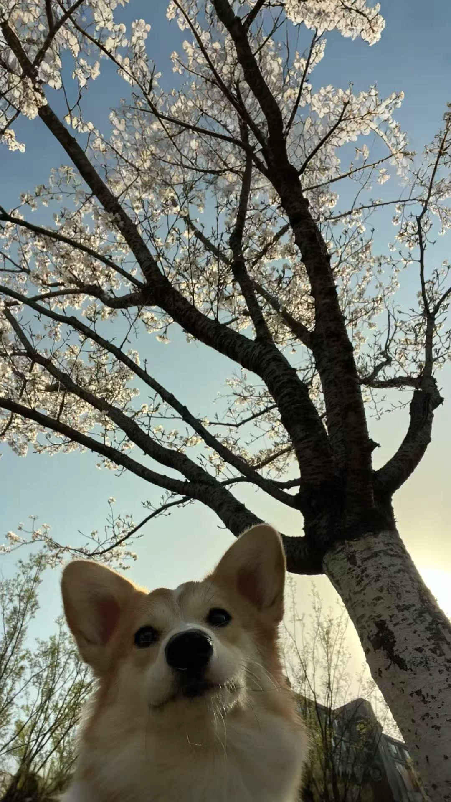
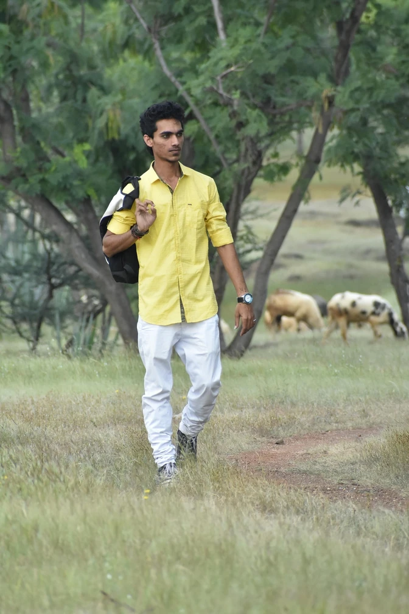

# Base (100 NFE) vs Distilled (8 NFE)

[← Back to README](../README.md).

## Run Base and Distilled Model

```bash
# Taking T2I for example
# Run Base
python examples/t2i/inference.py \
    --model_path sensenova/SenseNova-U1-8B-MoT \
    --jsonl examples/t2i/data/samples.jsonl \
    --output_dir outputs/ \
    --cfg_scale 4.0 --cfg_norm none --timestep_shift 3.0 --num_steps 50 \
    --profile


# Run 8-step preview model (deprecated)
python examples/t2i/inference.py \
    --model_path SenseNova-U1-8B-MoT-8step-preview \
    --jsonl examples/t2i/data/samples.jsonl \
    --output_dir outputs/ \
    --cfg_scale 1.0 --cfg_norm none --timestep_shift 3.0 --num_steps 8 \
    --profile

# Run 8-step LoRA
huggingface-cli download sensenova/SenseNova-U1-8B-MoT-LoRAs --include "SenseNova-U1-8B-MoT-LoRA-8step-V1.0.safetensors" --local-dir ./sensenova/SenseNova-U1-8B-MoT-LoRAs/ --local-dir-use-symlinks False
python examples/t2i/inference.py \
    --model_path sensenova/SenseNova-U1-8B-MoT \
    --lora_path sensenova/SenseNova-U1-8B-MoT-LoRAs/SenseNova-U1-8B-MoT-LoRA-8step-V1.0.safetensors \
    --jsonl examples/t2i/data/samples.jsonl \
    --output_dir outputs/ \
    --cfg_scale 1.0 --cfg_norm none --timestep_shift 3.0 --num_steps 8 \
    --profile
```

---

## Text-to-Image


| SenseNova-U1-8B-MoT (100 NFE) | SenseNova-U1-8B-MoT-8step-preview (8 NFE) |
|---|---|
|  |  |
|  |  |
|  |  |
|  |  |
|  |  |
|  |  |
|  |  |
|  |  |
|  |  |
|  |  |
|  |  |
|  |  |
|  |  |
|  |  |
|  |  |
|  |  |
|  |  |
|  |  |
|  |  |
|  |  |
|  |  |
|  |  |
|  |  |
|  |  |
|  |  |
|  |  |
|  |  |
|  |  |
|  |  |
|  |  |
|  |  |
|  |  |
|  |  |
|  |  |
|  |  |
|  |  |
|  |  |
|  |  |
|  |  |
|  |  |
|  |  |
|  |  |
|  |  |
|  |  |
|  |  |
|  |  |
|  |  |


## Image-Editing

| Reference Image | SenseNova-U1-8B-MoT (100 NFE) | SenseNova-U1-8B-MoT-8step-preview (8 NFE) |
|---|---|---|
|  |  |  |
|  |  |  |
|  |  |  |


## Existing Issues

A issue have been identified in the SenseNova-U1-8B-MoT-LoRA-8step-V1.0 (8 NFE), and we are actively working to resolve them. 

- Grid artifacts may occur in certain instances.
 
