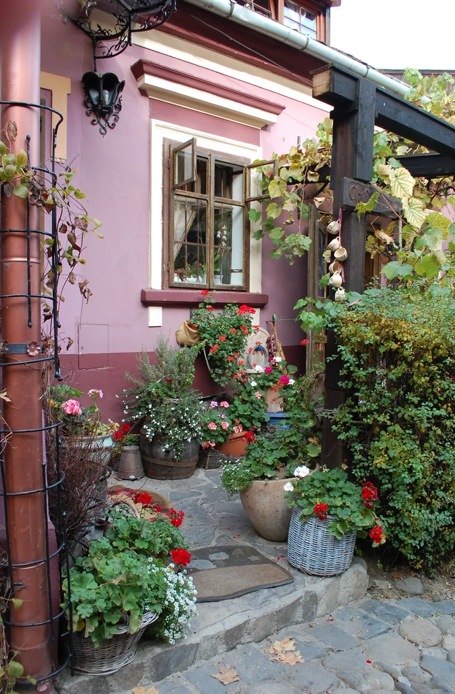
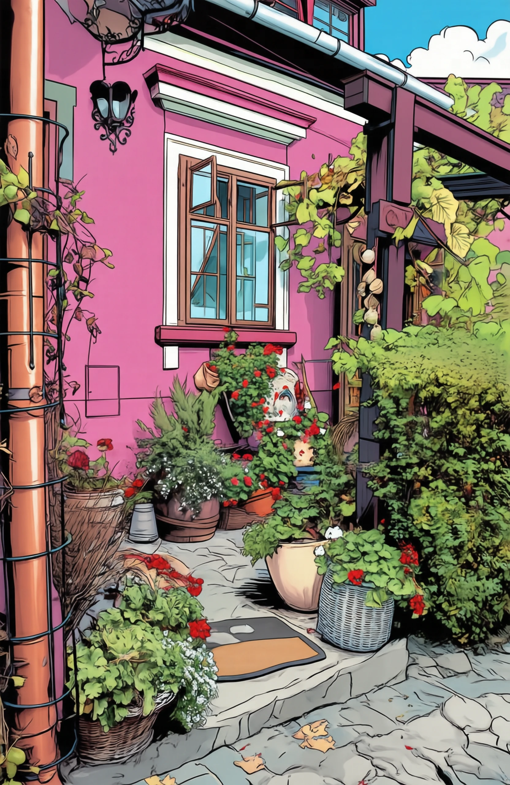
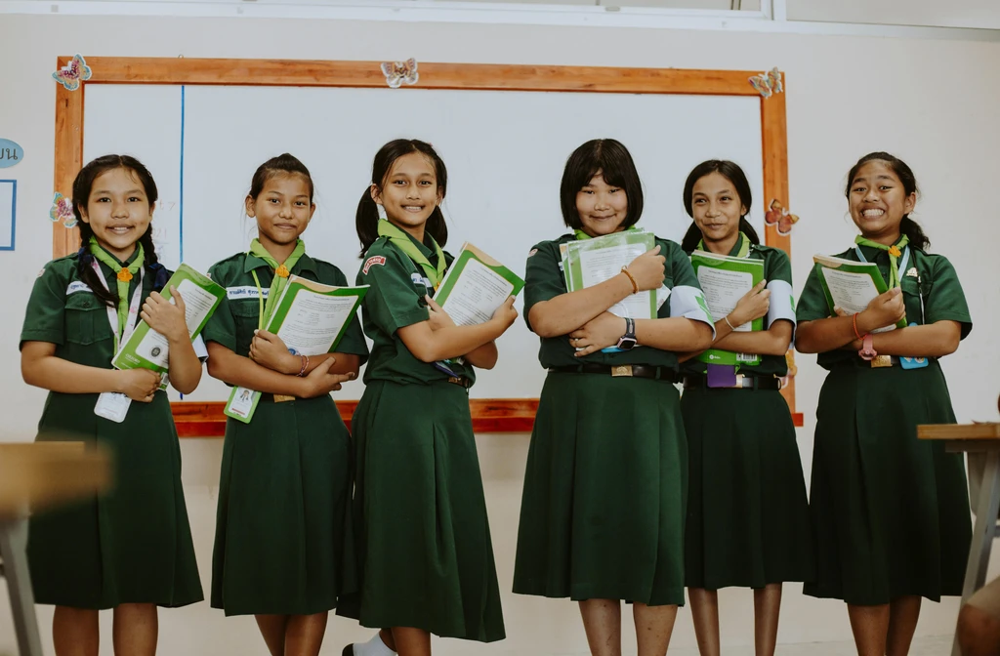
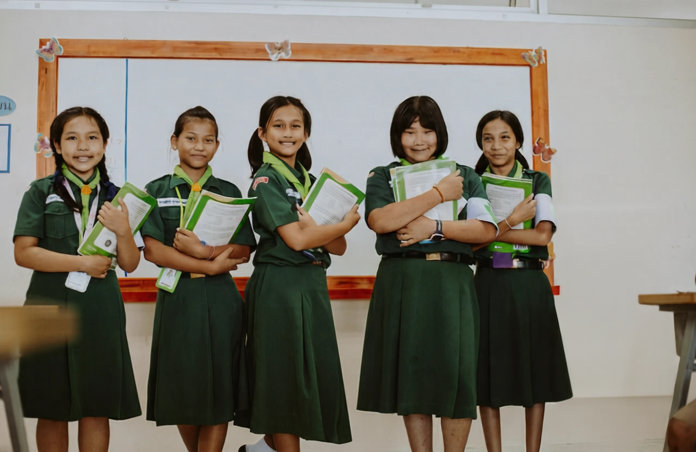

# SenseNova-U1 Showcases

[← Back to README](../README.md)

All samples below were generated by **SenseNova-U1** (see the main README
for the runnable commands). Images are stored as lossy WebP under
[`docs/assets/showcases/`](./assets/showcases/); click any thumbnail to
open the full-resolution render.

---

## Text-to-Image

The full 3 × 3 infographic grid (landscape / square / portrait) lives in
the main [README § Text-to-Image](../README.md#text-to-image-infographics)
to keep things in one place. Source prompts are in
[`examples/t2i/data/samples_infographic.jsonl`](../examples/t2i/data/samples_infographic.jsonl).

---

## Image Editing

Side-by-side compare montages below show `input(s) | output`, with the
edit instruction rendered along the bottom of each compare tile. The same
unified model handles single-image attribute / style / relighting edits
and multi-reference (subject + accessory + pose) composition.

Reproducible prompts are in
[`examples/editing/data/samples.jsonl`](../examples/editing/data/samples.jsonl).

| | |
| :---: | :---: |
| 
  Change the jacket of the person on the left to bright yellow.
 | 
  Make the person in the image smile.
 |
| 
  在小狗头上放一个花环，并且把图片变为吉卜力风格。
 | 
  Add a bouquet of flowers.
 |
| 
  Turn the image into an American comic style.
 | 
  Replace the text "WARFIGHTER" to "BATTLEFIELD" in the bold orange-red font.
 |
| 
  Replace the man with a woman.
 | 
  Remove the person on the far right wearing a green skirt and a green top.
 |

---

## Interleaved Generation

Each case below is a single rendered response from `model.interleave_gen`:
the model first runs a `<think>...</think>` reasoning block that produces
intermediate images, then emits the final interleaved text-and-image
answer

| |
| :---: |
|  |
|  |
|  |
|  |
|  |

---

## Visual Understanding

General visual understanding across spatial reasoning, multi-image comparison, OCR, geometry, and knowledge-intensive QA:

| | |
| :---: | :---: |
|  |  |
