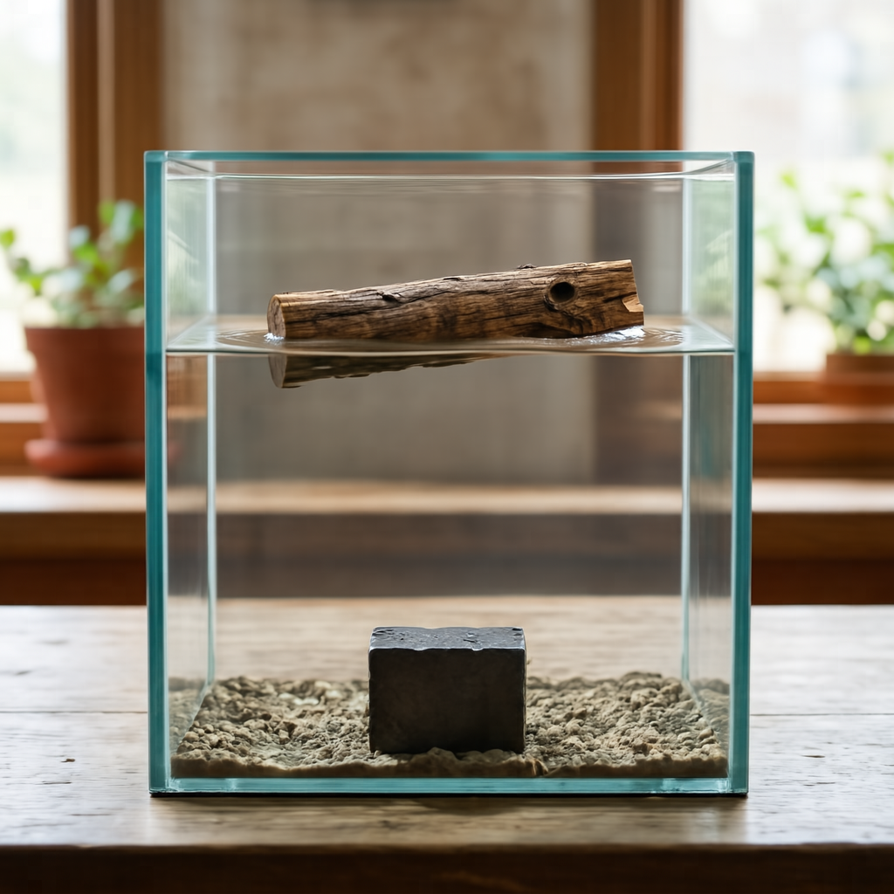
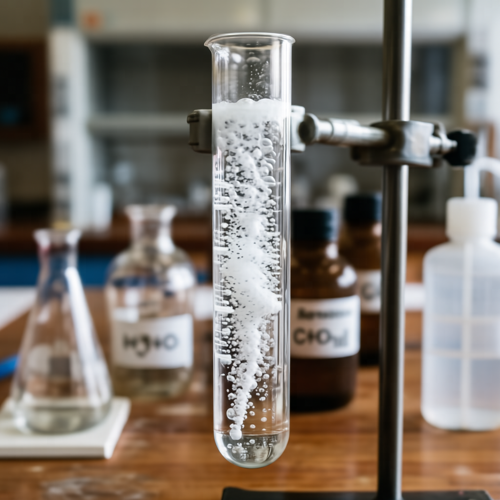

# Reasoning Text-to-Image Showcases

<table>
  <tr>
    <th style="width: 20%">Text</th>
    <th style="width: 50%">Reasoning Process</th>
    <th style="width: 30%">Resulting Images</th>
  </tr>
  <tr>
    <td style="vertical-align: top;">The playful craft that embodies Russian cultural charm</td>
    <td>
1. <b>Instruction Understanding:</b> The core subject is the matryoshka, identified as a Russian craft. Essential modifiers include playful and Russian cultural charm. The relation is that the craft embodies the charm. 2. <b>Reasoning Process:</b> The prompt identifies the matryoshka, the iconic Russian wooden doll set. 3. <b>Establish the frame:</b> The frame captures the matryoshka set in the foreground. The composition focuses on the Russian craft to show the playful nature of the doll set. 4. <b>Set the lighting and color:</b> Lighting illuminates the matryoshka to reveal the Russian cultural charm. The color palette supports the playful craft aesthetic. 5. <b>Lock the style:</b> The style emphasizes the wooden nature of the Russian craft. The finish reflects the charm of the matryoshka. 6. <b>Explicit Prompt:</b> A set of three colorful, hand-painted wooden matryoshka dolls arranged by size on a rustic wooden table, bright floral patterns, soft natural light.
</td>
    <td style="vertical-align: top;"></td>
  </tr>
  <tr>
    <td style="vertical-align: top;">A typical dish from the country where Naples is located</td>
    <td>
1. <b>Instruction Understanding:</b> The core subject is a Neapolitan pizza presented as a typical dish. The context specifies Naples, Italy, as the country of origin for this food item. 2. <b>Reasoning Process:</b> Naples is in Italy, and a classic dish is a Neapolitan pizza. 3. <b>Establish the frame:</b> The Neapolitan pizza is captured in a close-up shot that fills the central frame. The angle is slightly elevated to show the round form of the dish clearly. 4. <b>Set the lighting and color:</b> Soft lighting illuminates the surface of the Neapolitan pizza to reveal texture. Warm tones dominate the color palette, emphasizing the baked nature of the dish. 5. <b>Lock the style:</b> The image utilizes a realistic photographic style with sharp focus on the main subject. The finish appears natural and appetizing, suitable for food documentation. 6. <b>Explicit Prompt:</b> A delicious Neapolitan pizza with a soft, charred crust, tomato sauce, and fresh mozzarella, served on a rustic wooden table, realistic food photography.
</td>
    <td style="vertical-align: top;"></td>
  </tr>
  <tr>
    <td style="vertical-align: top;">A gigantic bubble in the immediate foreground with a small town barely visible inside</td>
    <td>
1. <b>Instruction Understanding:</b> The prompt requires a gigantic bubble positioned in the immediate foreground. A small town must be visible inside the bubble. 2. <b>Reasoning Process:</b> The bubble acts as a transparent lens, potentially distorting the town's appearance due to its curvature. 3. <b>Establish the frame:</b> The shot scale is an extreme close-up, placing the bubble so close it fills the majority of the frame. The focus plane is set on the bubble's surface, rendering the background outside the town soft and out of focus. 4. <b>Set the lighting and color:</b> Natural daylight creates bright specular highlights on the upper surface of the bubble. The color palette is dominated by the cool transparency of the bubble and the muted tones of the town within. 5. <b>Lock the style:</b> The overall image style is photorealistic with a high level of detail on the bubble's texture. The rendering captures the glossy finish and physical properties of the bubble accurately. 6. <b>Explicit Prompt:</b> An extreme close-up of a massive, transparent soap bubble floating in the immediate foreground, with a tiny, detailed miniature town visible inside the curvature, refracted and magnified by the surface tension, soft natural daylight, dreamlike, high detail, photorealistic texture.
</td>
    <td style="vertical-align: top;"></td>
  </tr>
  <tr>
    <td style="vertical-align: top;">A male peacock trying to attract a female</td>
    <td>
1. <b>Instruction Understanding:</b> The core subject is a single male peacock. The action involves the male peacock trying to attract a female. 2. <b>Reasoning Process:</b> Male peacocks perform this ritual by fanning their tail feathers into a massive, colorful circular display. 3. <b>Establish the frame:</b> The frame captures the male peacock in a full-body shot to show the entire display. The angle is eye-level to emphasize the height of the tail feathers. 4. <b>Set the lighting and color:</b> Natural lighting illuminates the colorful circular display with soft shadows. The palette features vibrant blues and greens on the tail feathers. 5. <b>Lock the style:</b> The style is a realistic photograph with sharp focus on the male peacock. The finish is natural without artistic filters. 6. <b>Explicit Prompt:</b> A vibrant male peacock with his tail feathers fully fanned out in a wide, iridescent display of blues and greens, standing in a garden.
</td>
    <td style="vertical-align: top;"></td>
  </tr>
  <tr>
    <td style="vertical-align: top;">A small piece of dry wood and a dense iron block are in a transparent water tank</td>
    <td>
1. <b>Instruction Understanding:</b> The core subjects are a small piece of dry wood and a dense iron block positioned within a transparent water tank. The wood is floating on the surface while the iron block is submerged at the bottom. 2. <b>Reasoning Process:</b> The wood is less dense than water so it will float, while the iron is denser and will sink to the bottom. 3. <b>Establish the frame:</b> The composition is a vertical medium shot centering the rectangular tank within the frame. The camera angle is eye-level to clearly display the water line and the submerged base. Focus is sharp across the entire depth of the tank to ensure both materials are distinct. 4. <b>Build the environment:</b> The scene is contained entirely within the clear glass walls of the water tank. The water fills the majority of the volume, providing a medium for the floating wood and sunken iron block. The background remains out of focus to keep attention on the tank's interior. 5. <b>Set the lighting and color:</b> Soft natural light illuminates the scene from the left, creating gentle reflections on the water surface. The color palette features the brown grain of the wood contrasting against the dark grey metallic finish of the iron. Shadows are soft and diffused through the liquid. 6. <b>Explicit Prompt:</b> A realistic photo of a transparent water tank showing a piece of wood floating on the surface and an iron block resting at the bottom.
</td>
    <td style="vertical-align: top;"></td>
  </tr>
  <tr>
    <td style="vertical-align: top;">A chocolate bar left in direct sunlight, highlighting the state of the chocolate</td>
    <td>
1. <b>Instruction Understanding:</b> The core subject is a chocolate bar positioned in direct sunlight. The focus is on the state of the chocolate, specifically how the heat affects it. 2. <b>Reasoning Process:</b> Heat causes chocolate to melt, losing its structured shape and becoming a viscous, glossy liquid. 3. <b>Establish the frame:</b> The composition is a close-up shot that fills the frame with the chocolate bar to emphasize detail. The angle is slightly elevated to show the top surface and the pooling liquid clearly. 4. <b>Build the environment:</b> The chocolate bar rests on a generic surface that supports the object without distracting from the main subject. The background is blurred to keep attention on the foreground elements and the chocolate. 5. <b>Set the lighting and color:</b> Direct sunlight creates bright highlights on the melting chocolate, emphasizing its glossy texture. The lighting is warm and intense, casting distinct shadows and illuminating the rich brown colors of the liquid. 6. <b>Explicit Prompt:</b> A close-up of a melting chocolate bar on a surface, with the edges losing their defined shape and pooling into a glossy, viscous puddle under the heat of the sun.
</td>
    <td style="vertical-align: top;"></td>
  </tr>
  <tr>
    <td style="vertical-align: top;">A solution of calcium carbonate reacting with acetic acid</td>
    <td>
1. <b>Instruction Understanding:</b> The core subject is a solution of calcium carbonate and acetic acid. The prompt specifies the reacting state of the chemical mixture. 2. <b>Reasoning Process:</b> The reaction produces carbon dioxide gas, which would be visible as a steady stream of bubbles rising through the liquid. 3. <b>Establish the frame:</b> The camera frames the solution closely to capture the details of the reaction. The composition centers on the liquid where the gas is visible. 4. <b>Set the lighting and color:</b> The liquid appears clear, allowing the white bubbles to stand out distinctly. The lighting is bright and even to illuminate the stream of gas. 5. <b>Lock the style:</b> The image maintains a realistic photographic style suitable for scientific observation. The focus is sharp on the reacting solution and bubbles. 6. <b>Explicit Prompt:</b> A test tube filled with a clear liquid and a rapid, effervescent stream of carbon dioxide bubbles rising to the surface, laboratory experiment.
</td>
    <td style="vertical-align: top;"></td>
  </tr>
</table>
